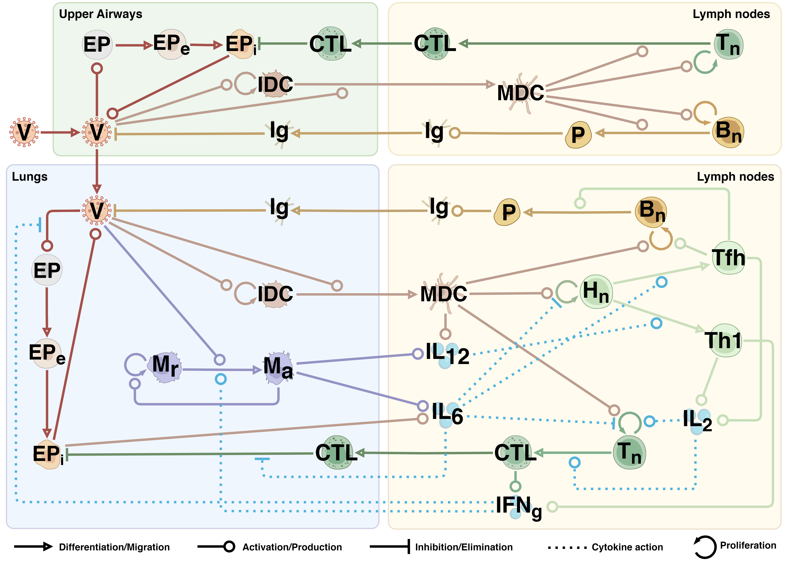

# Multi-compartmental model of the immune response to SARS-CoV-2 infection ([DOI: 10.3390/v17050589](https://www.mdpi.com/1999-4915/17/5/589))

The model consists of two main parts: the **upper airways** (including the nasal cavity, oral cavity, and pharynx) and the **lower airways** (including the trachea, bronchial tree, and lungs). Each structural module is connected to a **draining lymph node compartment**, in overall forming four interconnected modules. The model incorporates innate immunity, involving macrophages and dendritic cells, and adaptive immunity, comprising humoral (antibodies) and cellular (CTLs, Th1, and Tfh cells) components. Cellular interactions in the model are facilitated by direct contacts, such as antigen presentation, or by cytokine signaling via IL-2, IL-6, IL-12, and IFNγ.

 

  

Figure 1. A schematic representation of the model. The process notations are provided below the diagram. V – virus, EP – epithelial cells (e – exposed, i – infected), DC – dendritic cells (I – immature, M - mature), M – macrophages (r – resting, a – activated), Hn – naïve CD4+ T cells, Tn – naïve CD8+ T cells, Bn – naïve B cells, Th1 – T helper 1 type cells, Tfh – T follicular helper cells, CTL – cytotoxic T cells, P – plasma cells, Ig – immunoglobulins (IgA, IgM, IgG), IL – interleukins (2, 6, 12), IFNg – interferon gamma

 
 
The model was developed using the Julia programming language, and the simulation results were plotted using Python's matplotlib library.
 
 
Files are provided via following links:

- [Supplementary](supplementary)
- [Simulation results](simulation_results)
- [Model](sars-cov-2-model-of-the-immune-response.jl)
